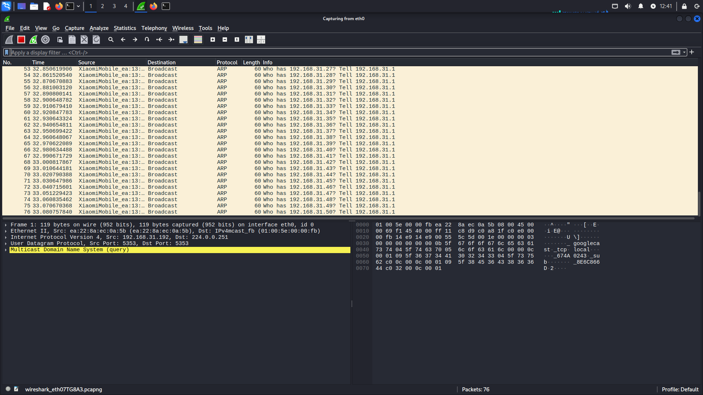
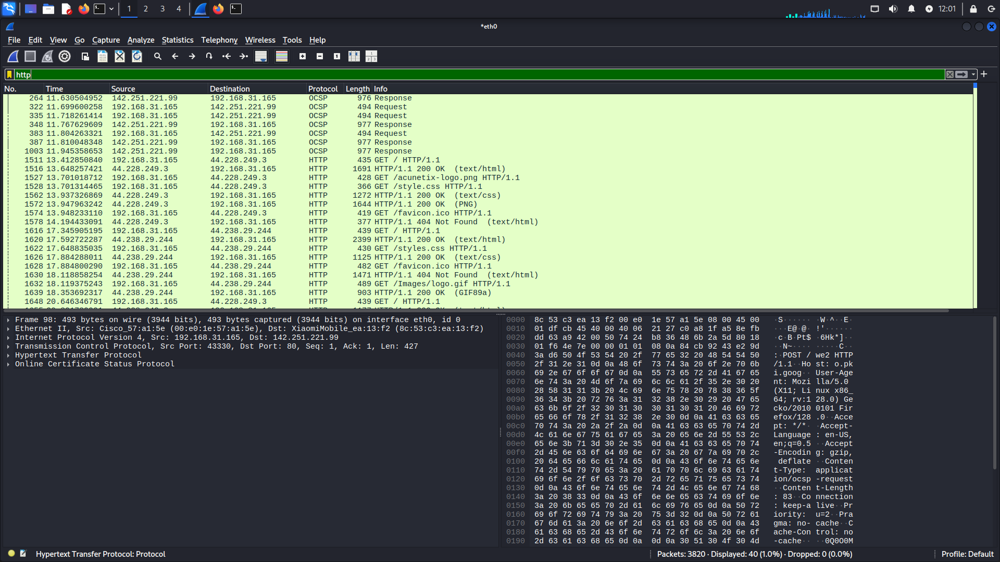
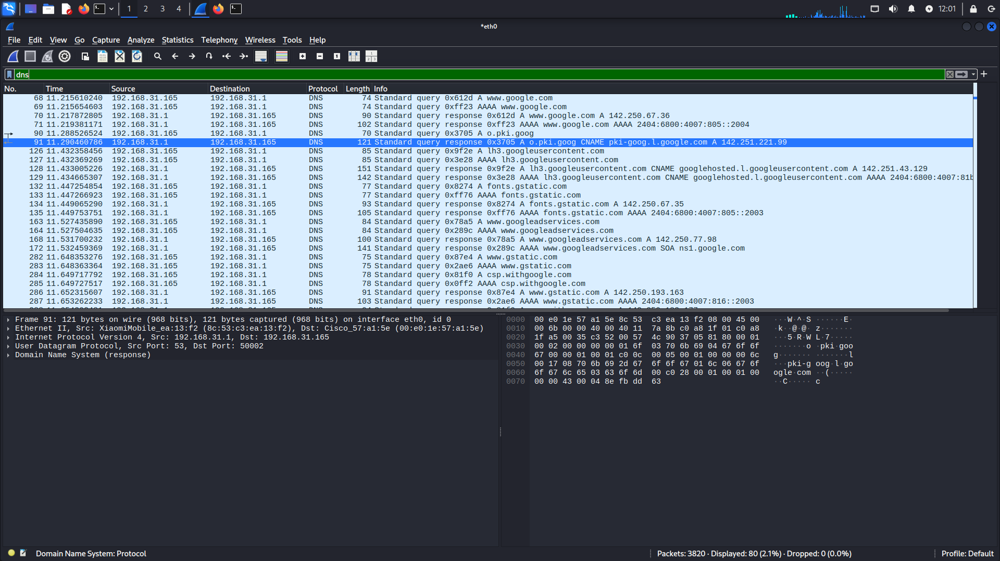
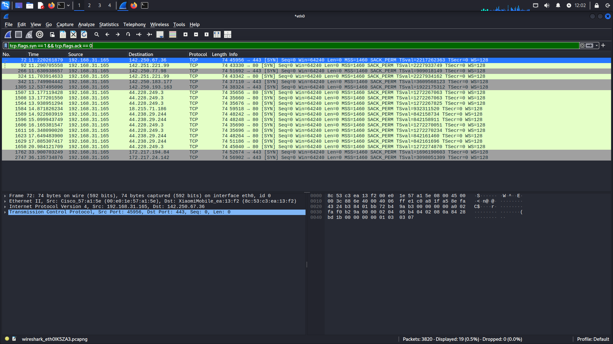
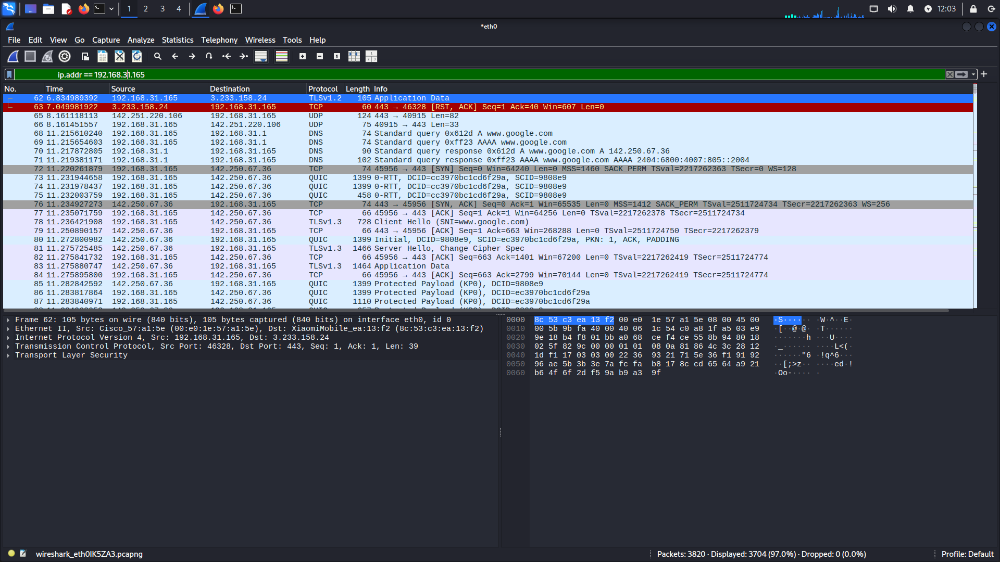
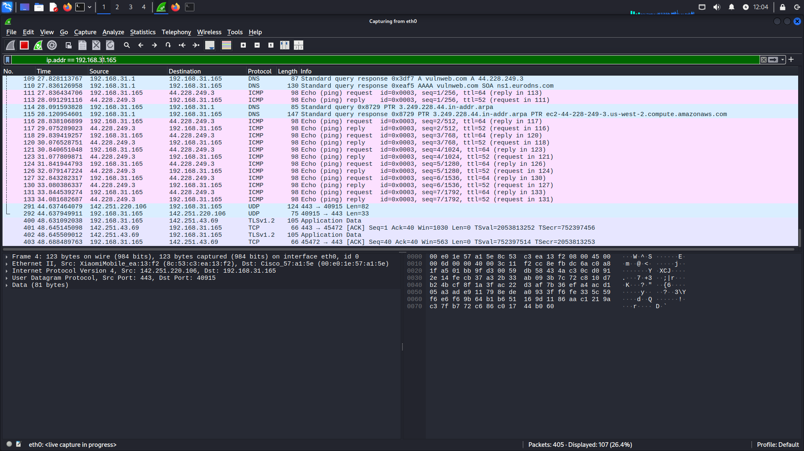

# Task 5 – Wireshark Network Traffic Analysis

## Overview
This task involved using **Wireshark** to capture, filter, and analyze live network traffic.  
The objective was to inspect multiple protocols, apply filters, and document packet details, including ARP, DNS, HTTP, TCP, TLS, ICMP, and more.

---

## Tools Used
- **Wireshark** (Packet capture & analysis)
- **Linux (Kali)** – for running Wireshark and managing capture sessions

---

## Steps Performed

1. **Started Packet Capture**
   - Selected the active network interface (`eth0`) in Wireshark.
   - Initiated capture to monitor live traffic.

2. **Applied Protocol Filters**
   - Used Wireshark filters for targeted analysis:
     - `arp` – View ARP broadcast requests/replies.
     - `http` – Analyze HTTP requests/responses.
     - `dns` – Inspect DNS queries and responses.
     - `tcp.flags.syn == 1 && tcp.flags.ack == 0` – View TCP handshake initiation.
     - `ip.addr == 192.168.x.x` – Filter traffic from a specific IP.
     - `icmp` – View ping requests and replies.

3. **Analyzed Packet Details**
   - Checked packet source/destination IP addresses.
   - Verified ports and protocols.
   - Viewed payload data in **Hex** and **ASCII** format.

4. **Saved Screenshots for Documentation**
   - Captured different stages of the analysis to show protocol activity.

---

## Screenshots

### 1. ARP Traffic Analysis
  
Displays **Address Resolution Protocol** broadcasts for resolving IP to MAC addresses.

---

### 2. HTTP Traffic Analysis
  
Shows HTTP GET requests and responses including headers and requested resources.

---

### 3. DNS Traffic Analysis
  
Captured DNS queries and responses, showing resolved domain names and IP addresses.

---

### 4. TCP Handshake Analysis
  
Filtered initial **SYN** packets used in TCP connection establishment.

---

### 5. TLS/QUIC Secure Communication
  
Observed encrypted traffic and handshake details for secure HTTPS connections.

---

### 6. ICMP Ping Requests/Replies
  
Displayed ping request/response sequences for connectivity testing.

---

## Conclusion
This task demonstrated:
- Efficient packet capture with Wireshark.
- Use of protocol-specific filters for targeted analysis.
- Interpretation of key network communication details.
- Documentation using relevant screenshots for each observed protocol.

---

